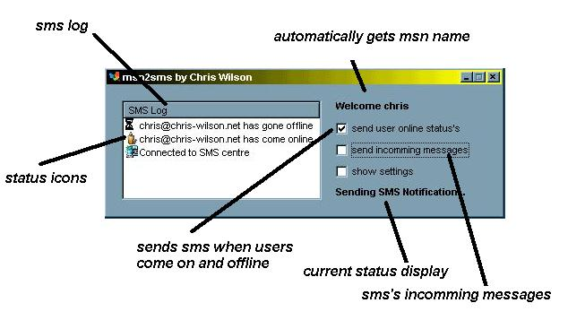



## MSN Messenger 2 Text Message\!

### Description

Sends MSN events and messages directly to your mobile phone within seconds.

Requires an ICQ account but ICQ software not needed.

You have to enter ure mobile number in this format:

COUNTRYCODE PREFIX  NUMBER

44      7712   123456
 
### More Info
 

             |
---                |---
**Submitted On**   |2001-09-04 14:32:20
**By**             |[Chris Wilson UK](https://github.com/Planet-Source-Code/PSCIndex/blob/master/ByAuthor/chris-wilson-uk.md)
**Level**          |Intermediate
**User Rating**    |4.8 (29 globes from 6 users)
**Compatibility**  |VB 6\.0
**Category**       |[Complete Applications](https://github.com/Planet-Source-Code/PSCIndex/blob/master/ByCategory/complete-applications__1-27.md)
**World**          |[Visual Basic](https://github.com/Planet-Source-Code/PSCIndex/blob/master/ByWorld/visual-basic.md)
**Archive File**   |[MSN Messen25892942001\.zip](https://github.com/Planet-Source-Code/chris-wilson-uk-msn-messenger-2-text-message__1-26964/archive/master.zip)

